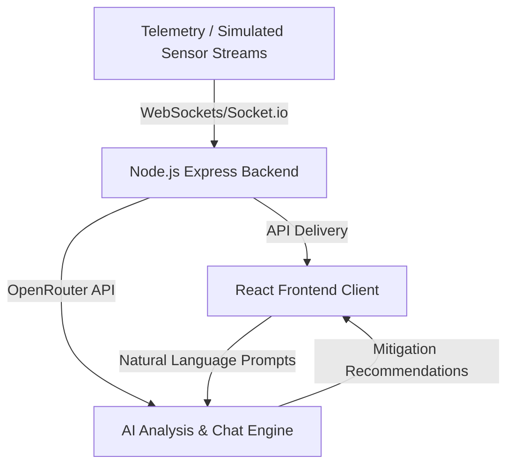

# RescueAI — Intelligent Emergency Response Command Center 🌪️🚒

RescueAI is a modern, real-time, AI-driven disaster response and resource coordination dashboard designed for first responders, emergency operations managers, and crisis commanders. 

It processes multi-hazard situational telemetry (cyclones, floods, fires, collapses) in real time, automatically drafting tactical mitigation plans using cutting-edge LLMs (via OpenRouter), and hosting an interactive conversational assistant to instantly query dynamic shelter, hospital, and ambulance resources.

---

## 🚀 Key Features

* **Live Situational Metrics:** Real-time tracking of active incidents, displaced/affected populations, open shelters, available hospital beds, deployed units, and pending AI actions.
* **AI Incident Analysis Engine:** Automatically evaluates incoming incident alerts and instantly drafts targeted, step-by-step containment protocols and tactical dispatch recommendations.
* **Emergency Conversational Assistant:** Interactive chat coordinator allowing dispatchers to issue natural language questions to search through real-time resource indices (e.g., *"Show me all open shelters with active power backup and medical staff"*).
* **Live Simulated Telemetry Stream:** Built-in WebSocket simulation engine driving immediate alert notifications and live operational updates.
* **Premium High-Contrast UI:** Dark-mode glassmorphic interface built using HSL semantic coloring specifically optimized for rapid scanning in high-pressure rooms.

---

## 🛠️ Technology Stack

* **Frontend:** React.js, Vite, TailwindCSS, Socket.io-client
* **Backend:** Node.js, Express, Socket.io
* **AI & Intelligence:** OpenRouter API (Accessing state-of-the-art models like Llama 3.3 70B Instruct for high-quality tactical recommendations)
* **Dev Accelerators:** Antigravity AI (Gemini-powered IDE) for fast full-stack prototyping, robust API setup, and hotfixes.

---

## 🌐 System Architecture



---

## 📋 Environment Configuration

Create a `.env` file in the root directory. You can copy the template from `.env.example`:

```env
PORT=5000
CLIENT_ORIGIN=http://localhost:5173
OPENROUTER_API_KEY=your_openrouter_api_key_here
OPENROUTER_MODEL=meta-llama/llama-3.3-70b-instruct
```

---

## 🏃 Getting Started & Installation

Follow these steps to set up and run RescueAI locally.

### 1. Clone the Repository
```bash
git clone https://github.com/bhanuprakashpeddi-1432/RescueAI.git
cd RescueAI
```

### 2. Install Dependencies
```bash
npm install
```

### 3. Run in Development Mode
To run both the Express backend API and the Vite frontend dev server concurrently:
```bash
npm run dev
```

* **Frontend Dev Server:** `http://localhost:5173`
* **Backend API Server:** `http://localhost:5000`

### 4. Build for Production
To compile and optimize the frontend for hosting environments (e.g., Render, Vercel):
```bash
npm run build
```

---

## 📦 Production Deployment (Render)

RescueAI features a self-configuring, production-grade Express server in [server/app.js](server/app.js). 

When you build the project (`npm run build`), the Express server will automatically serve the production build under `/` (root route) without needing any environment variable modifications!

* **Build Command on Render:** `npm install && npm run build`
* **Start Command on Render:** `npm run start`
